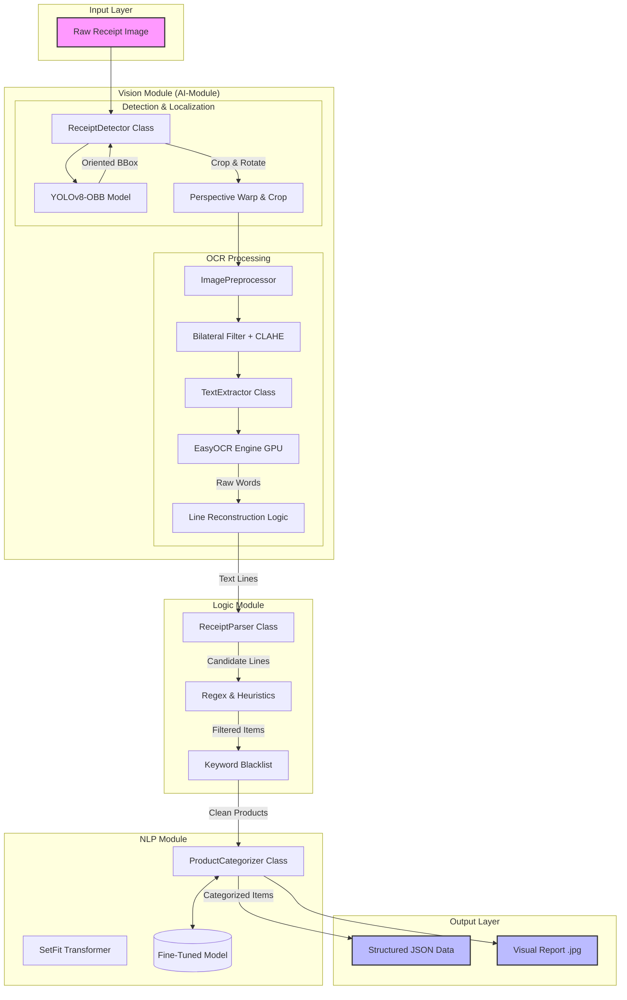

## Architektura Systemu

Poniższy diagram przedstawia przepływ danych w module AI:

```mermaid
graph TD
    subgraph "Input Layer"
        RawImg[Raw Receipt Image]
        style RawImg fill:#f9f,stroke:#333,stroke-width:2px
    end

    subgraph "Vision Module (AI-Module)"
        direction TB
        
        subgraph "Detection & Localization"
            YOLO[YOLOv8-OBB Model]
            Detector[ReceiptDetector Class]
            Warp[Perspective Warp & Crop]
        end
        
        subgraph "OCR Processing"
            Pre[ImagePreprocessor]
            Filters[Bilateral Filter + CLAHE]
            EasyOCR[EasyOCR Engine GPU]
            Extractor[TextExtractor Class]
            LineGluing[Line Reconstruction Logic]
        end
    end

    subgraph "Logic Module"
        Parser[ReceiptParser Class]
        Regex[Regex & Heuristics]
        Blacklist[Keyword Blacklist]
    end

    subgraph "NLP Module"
        SetFit[SetFit Transformer]
        Categorizer[ProductCategorizer Class]
        ModelDB[(Fine-Tuned Model)]
    end

    subgraph "Output Layer"
        JSON[Structured JSON Data]
        Vis[Visual Report .jpg]
        style JSON fill:#bbf,stroke:#333,stroke-width:2px
        style Vis fill:#bbf,stroke:#333,stroke-width:2px
    end

    %% Flows
    RawImg --> Detector
    Detector --> YOLO
    YOLO -- Oriented BBox --> Detector
    Detector -- Crop & Rotate --> Warp
    Warp --> Pre
    Pre --> Filters
    Filters --> Extractor
    Extractor --> EasyOCR
    EasyOCR -- Raw Words --> LineGluing
    LineGluing -- Text Lines --> Parser
    Parser -- Candidate Lines --> Regex
    Regex -- Filtered Items --> Blacklist
    Blacklist -- Clean Products --> Categorizer
    Categorizer <--> ModelDB
    Categorizer -- Categorized Items --> JSON
    Categorizer --> Vis
```